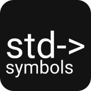

# Symbols



## О проекте

**Symbols** — это простой и удобный онлайн-сервис для подсчёта символов в тексте. Приложение предоставляет мгновенную статистику о введённом тексте, включая количество символов, слов, абзацев и многое другое.

Проект доступен по адресу: [https://kianurivzzz.github.io/symbols/](https://kianurivzzz.github.io/symbols/)

## Возможности

### Основная статистика
- Подсчёт символов с пробелами;
- Подсчёт символов без пробелов;
- Количество слов;
- Количество абзацев.

### Расширенная статистика
- Количество предложений;
- Средняя длина предложения;
- Количество уникальных слов;
- Индекс читабельности текста;
- Топ-10 самых используемых слов.

### Дополнительные функции
- История введенных текстов. Сохраняется в localStorage;
- Тёмная и светлая темы. Автоматически определяется по системным настройкам;
- Копирование текста в буфер обмена;
- Очистка текстового поля.

## Технологии

Проект разработан с использованием следующих технологий:

- HTML5;
- CSS3;
- JavaScript. ES6+;
- Bootstrap 5.

## Особенности реализации

### Индекс читабельности
Индекс читабельности рассчитывается по адаптированной формуле Флеша-Кинкейда для русского языка. Он показывает, насколько легко читается текст. Чем выше значение, то есть ближе к 100, тем проще текст для восприятия.

### История текстов
Приложение автоматически сохраняет введённые тексты в localStorage браузера. Пользователь может просматривать историю, восстанавливать ранее введённые тексты или удалять записи из истории.

### Адаптивный дизайн
Интерфейс приложения адаптирован для комфортного использования как на десктопных, так и на мобильных устройствах.

## Установка и запуск

Для локального запуска проекта:

1. Клонируйте репозиторий:
```bash
git clone git@github.com:kianurivzzz/symbols.git
```

2. Откройте файл `index.html` в любом современном браузере.

## Автор

Проект разработан [Никитой Карасёвым](https://nkarasyov.ru).

## Лицензия

Проект распространяется под лицензией MIT. Подробности в файле LICENSE.
