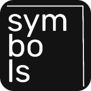

# Symbols



## О проекте

**Symbols** — это простой и удобный онлайн-сервис для подсчёта символов в тексте. Приложение предоставляет мгновенную статистику о введённом тексте, включая количество символов, слов, абзацев и многое другое.

Проект доступен по адресу – [https://kianurivzzz.github.io/symbols/](https://kianurivzzz.github.io/symbols/)

## Возможности

### Основная статистика
- Подсчёт символов с пробелами;
- Подсчёт символов без пробелов;
- Количество слов;
- Количество абзацев.

### Расширенная статистика
- Количество предложений;
- Средняя длина предложения;
- Количество уникальных слов;
- Индекс читабельности текста;
- Топ-10 самых используемых слов.

### Автодополнение текста
- Интеллектуальное предложение слов при вводе;
- Обучение на основе введенного пользователем текста;
- Работает как в обычном режиме, так и в режиме фокусировки;
- Словарь часто используемых русских слов.

### Режим фокусировки
- Полноэкранный режим для комфортного письма без отвлечений;
- Встроенный таймер с настраиваемыми интервалами. 5, 15, 25, 30, 45, 60 минут;
- Возможность установки произвольного времени таймера;
- Звуковое и визуальное уведомление по окончании таймера;
- Отображение статистики текста в режиме реального времени.

### Дополнительные функции
- История введенных текстов. Сохраняется в localStorage;
- Тёмная и светлая темы. Автоматически определяется по системным настройкам;
- Копирование текста в буфер обмена;
- Очистка текстового поля;
- Возможность поделиться статистикой в социальных сетях;
- Сохранение статистики в виде изображения;
- Скачивание текста в формате TXT.

## Технологии

Проект разработан с использованием следующих технологий:

- HTML5;
- CSS3;
- JavaScript. ES6+;
- Bootstrap 5;
- html2canvas для генерации изображений;
- autoComplete.js для функции автодополнения текста.

## Особенности реализации

### Индекс читабельности
Индекс читабельности рассчитывается по адаптированной формуле Флеша-Кинкейда для русского языка. Он показывает, насколько легко читается текст. Чем выше значение, то есть ближе к 100, тем проще текст для восприятия.

### Автодополнение текста
Функция автодополнения предлагает пользователю варианты слов при вводе текста. Система использует предустановленный словарь часто используемых русских слов, а также обучается на основе текстов, которые вводит пользователь. Это позволяет со временем предлагать более релевантные варианты, соответствующие стилю и тематике текстов конкретного пользователя.

### История текстов
Приложение автоматически сохраняет введённые тексты в localStorage браузера. Пользователь может просматривать историю, восстанавливать ранее введённые тексты или удалять записи из истории.

### Режим фокусировки
Режим фокусировки предоставляет минималистичный интерфейс для концентрации на процессе письма. Встроенный таймер помогает организовать работу по методу Pomodoro или другим техникам тайм-менеджмента. Текст автоматически синхронизируется между основным редактором и режимом фокусировки.

### Экспорт данных
Пользователи могут экспортировать свой текст в формате TXT для дальнейшего использования в других приложениях или сохранения на устройстве.

### Адаптивный дизайн
Интерфейс приложения адаптирован для комфортного использования как на десктопных, так и на мобильных устройствах.

## Установка и запуск

Для локального запуска проекта:

1. Клонируй репозиторий:
```bash
git clone git@github.com:kianurivzzz/symbols.git
```

2. Открой файл `index.html` в любом современном браузере.

## Автор

Проект разработан [Никитой Карасёвым](https://nkarasyov.ru).

## Лицензия

Проект распространяется под лицензией MIT. Подробности в файле LICENSE.
